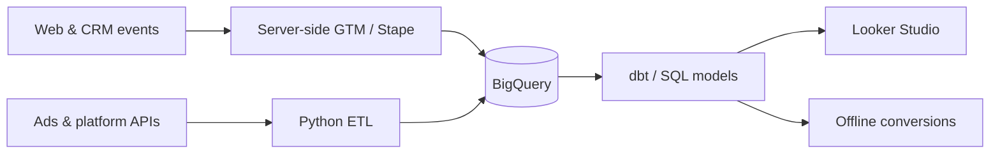
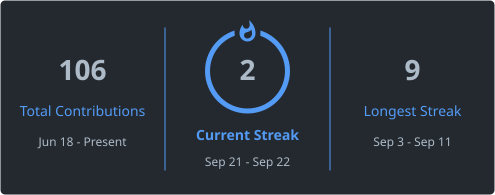
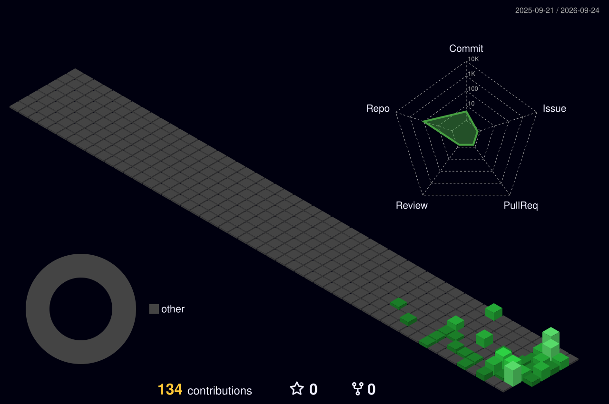

  
  
  
  

# Ivan Yermakov

**Analytics Engineer · Data Engineer**  
Augsburg, Bavaria, Germany · open to new roles

  
  
  

I design production data infrastructure for performance marketing: BigQuery warehouses, dbt and SQL models, Python ETL, and server-side GTM. Seven years commercial — agencies, global brands, and high-growth e-commerce.

The full résumé lives on [ivanyermakov.com](https://ivanyermakov.com). Roles and collaborations: [LinkedIn](https://linkedin.com/in/yermakovivan).

### Skills

| Area | Tools |
| --- | --- |
| **Data warehouse & modeling** |     |
| **ETL & Python** |     |
| **Tracking & analytics** |     |
| **CI / CD & tooling** |     |
| **Domain** |     |

### Data stack

### GitHub activity

  <picture>
    <source media="(prefers-color-scheme: dark)" srcset="https://raw.githubusercontent.com/yermakoffivan/yermakoffivan/output/github-contribution-grid-snake-dark.svg" />
    <source media="(prefers-color-scheme: light)" srcset="https://raw.githubusercontent.com/yermakoffivan/yermakoffivan/output/github-contribution-grid-snake.svg" />
    
  </picture>

| Stats | Languages |
| --- | --- |
|  |  |

  

  

### Trophies

  

### Reach me

  
  
  

### Star history

  

---

*Built for [github.com/yermakoffivan](https://github.com/yermakoffivan). Assets under `profile/` refresh daily via GitHub Actions.*
